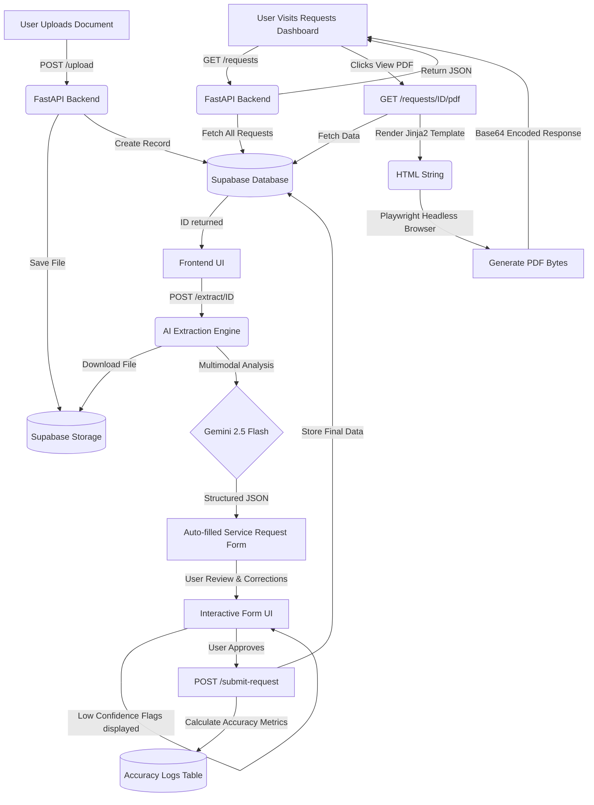
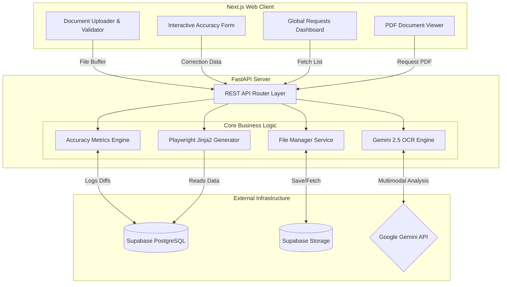

# Solum Health - Clinical Document Processing System

A full-stack monorepository for intelligent extraction and management of medical service requests from clinical documents (PDFs, images, scans).

## 🚀 Overview

This system automates the "Request for Approval of Services" workflow. It extracts structured data from uploaded documents using AI, auto-fills a standardized service request form, tracks the accuracy of the AI's extractions based on user corrections, and generates a finalized, structured PDF of the service request.

## 🛠 Tech Stack

- **Frontend:** Next.js (App Router), TypeScript, Tailwind CSS
- **Backend:** FastAPI (Python 3.11), Uvicorn
- **AI/ML (OCR & Extraction):** Google Gemini 2.5 Flash
- **PDF Generation:** Playwright (Headless Chromium) & Jinja2 Templates
- **Database & Auth:** Supabase (PostgreSQL)
- **Storage:** Supabase Storage (Private Buckets)
- **Infrastructure:** Vercel (Frontend Next.js app), Railway (Backend FastAPI app via Nixpacks)

## 🔄 System Flow



## 🧩 Modules Architecture



## ⚙️ Core Modules & Architecture Features

### 1. Document Upload & Storage

- Files (PDF, JPG, PNG) are uploaded to a private Supabase Storage bucket (`medical-documents`).
- A database record tracks the document's processing `status` (pending, completed).

### 2. OCR & Multimodal AI Extraction (Gemini 2.5 Flash)

- The raw file is passed to Google's **Gemini 2.5 Flash** model.
- It performs layout-aware multimodal extraction, structuring unstructured clinical notes into a strict JSON schema containing patient info, provider details, medications, and diagnosis codes.
- The model calculates confidence scores, flagging low-confidence extractions for manual review.

### 3. Interactive Review & Accuracy Tracking

- The extracted JSON pre-fills a dashboard form. Low-confidence fields are highlighted with warning indicators.
- When the user submits the final (corrected) form, the backend compares the user's input against the AI's original extraction.
- Differences are logged to calculate real-time OCR accuracy metrics (e.g., "Patient Name: 98% Accuracy"), viewable on the Accuracy Dashboard.

### 4. Advanced PDF Generation

- Upon viewing a completed request, the backend fetches the stored structured data.
- The data is injected into a **Jinja2 HTML template**.
- **Playwright** (running a headless Chromium browser instance) renders the HTML and prints it to a perfectly formatted, pixel-perfect PDF buffer, which is returned to the frontend.

### 5. Resilient Architecture & Deployment

- **Lazy Client Initialization:** External clients (Supabase, Gemini) are initialized lazily inside route handlers. This prevents the server from crashing on startup if environment variables are missing, ensuring health checks pass smoothly in containerized environments.
- **Railway & Nixpacks:** The backend is deployed to Railway using a custom `nixpacks.toml` configuration. This overrides the default build phases to create an isolated Python virtual environment (`.venv`), avoiding PEP-668 immutable filesystem errors and ensuring `pip`, `uvicorn`, and `playwright` browser binaries are correctly installed in the production container.
- **Vercel Dynamic Routing:** The Next.js frontend uses `NEXT_PUBLIC_API_URL` to route requests dynamically to localhost during development and the Railway API URL in production.

## 📂 Project Structure

```text
solum-health/
├── apps/
│   ├── api/                # FastAPI Backend
│   │   ├── main.py         # Main API routes, DB lazy init, API logic
│   │   ├── pdf_service.py  # Playwright & Jinja2 PDF generator
│   │   ├── templates/      # HTML templates for PDF rendering
│   │   └── requirements.txt
│   └── web/                # Next.js Frontend
│       ├── src/
│       │   ├── app/        # Next.js Page routes (Dashboard, Requests)
│       │   ├── components/ # React UI components (Upload, ExtractionForm)
│       │   └── lib/        # Supabase Client
├── supabase/
│   └── migrations/         # Database Schema & Initial Migrations
├── package.json            # Monorepo Workspace Config
├── pnpm-workspace.yaml     # pnpm settings
├── nixpacks.toml           # Railway build phase overrides (Python setup)
└── railway.toml            # Railway service configuration
```

## 🚀 Getting Started

### Prerequisites

- Node.js (v18+) & pnpm
- Python 3.11+
- Supabase Project (URL, Anon Key, Secret Key)
- Google/Gemini API Key

### Local Installation

1. **Clone & Install Dependencies:**

   ```bash
   pnpm install

   cd apps/api
   python3 -m venv venv
   source venv/bin/activate
   pip install -r requirements.txt
   playwright install chromium --with-deps
   ```

2. **Configure Environment:**
   - Create `apps/web/.env.local` for Next.js (add `NEXT_PUBLIC_SUPABASE_URL` and `NEXT_PUBLIC_SUPABASE_ANON_KEY`)
   - Create `apps/api/.env` for FastAPI (add `SUPABASE_URL`, `SUPABASE_KEY`, `GOOGLE_API_KEY`)

3. **Database Setup:**
   - Run the initial migrations against your Supabase project or execute the SQL schema directly in the Supabase SQL editor.
   - Ensure a **Private** bucket named `medical-documents` exists.

4. **Run Application:**
   - From the repository root, start the development server for both frontend and backend:

   ```bash
   pnpm dev
   ```

   - The frontend will be available at `http://localhost:3000`
   - The API will be available at `http://localhost:8000`
