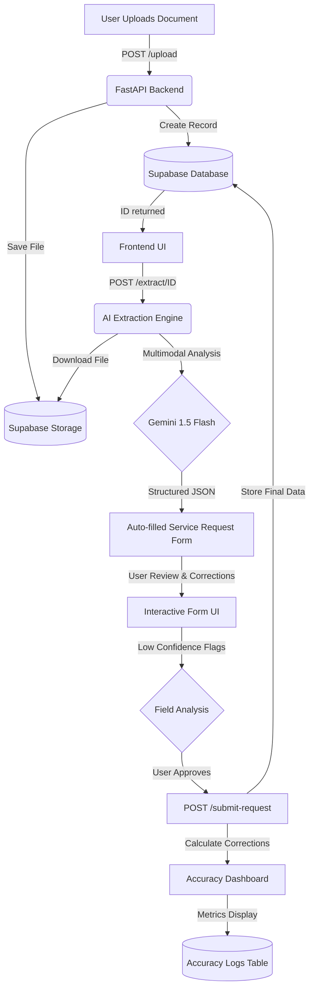

# Solum Health - Clinical Document Processing System

A full-stack monorepository for intelligent extraction and management of medical service requests from clinical documents (PDFs, images, scans).

## 🚀 Overview

This system automates the "Request for Approval of Services" workflow. It extracts structured data from uploaded documents using AI (Gemini 1.5 Flash), auto-fills a standardized service request form, and tracks the accuracy of the AI's extractions based on user corrections.

## 🛠 Tech Stack

- **Frontend:** Next.js (App Router), TypeScript, Tailwind CSS
- **Backend:** FastAPI (Python 3.13), Uvicorn
- **AI/ML:** Google Gemini 1.5 Flash (for multimodal extraction)
- **Database & Auth:** Supabase (PostgreSQL)
- **Storage:** Supabase Storage (Private Buckets)
- **Infrastructure:** Vercel (Web), Railway (API)

## 🔄 System Flow



The application follows a linear, 5-step process designed for high-accuracy data entry:

### 1. Document Upload
- **Action:** User uploads a clinical document (PDF, JPG, or PNG) via the drag-and-drop interface.
- **Process:** The frontend sends the file to the FastAPI `/upload` endpoint.
- **Storage:** The file is saved in a private Supabase Storage bucket (`medical-documents`). A new record is created in the `documents` database table with a `pending` status.

### 2. Multimodal AI Extraction
- **Action:** Once uploaded, the frontend triggers the `/extract/{document_id}` endpoint.
- **Process:** The backend downloads the file from Storage and sends it to **Gemini 1.5 Flash**.
- **Extraction:** The AI analyzes the document (multimodal) and extracts key fields (Patient info, Provider info, ICD-10/CPT codes, medications, etc.) into a structured JSON format.
- **Confidence Scoring:** The AI is prompted to flag fields where it has lower confidence.

### 3. Interactive Review & Correction
- **Action:** The frontend receives the extracted JSON and populates the "Request for Approval of Services" form.
- **UI Indicators:** 
  - **High Confidence:** Fields appear normal.
  - **Low Confidence:** Fields are highlighted with a **⚠️ Warning Icon** and a yellow background to alert the user.
- **Process:** The user reviews the pre-filled data, correcting any errors or filling in missing information.

### 4. Final Submission
- **Action:** User clicks "Approve & Submit Request".
- **Process:** The final form data is sent to the `/submit-request` endpoint.
- **Storage:** 
  - The validated request is saved to the `service_requests` table.
  - Sub-items like medications and assessments are saved to their respective related tables.
  - The document status is updated to `completed`.

### 5. Accuracy Tracking (Feedback Loop)
- **Process:** During submission, the backend compares the **initial AI extraction** with the **final user-approved data**.
- **Logging:** Any differences are logged in the `extraction_accuracy_logs` table, marking whether a field was "corrected."
- **Dashboard:** The **Accuracy Dashboard** fetches these logs and calculates real-time accuracy percentages for every field (e.g., "Patient Name: 98% Accuracy"). This helps measure and improve the extraction quality over time.

## 📂 Project Structure

```text
solum-health/
├── apps/
│   ├── api/                # FastAPI Backend
│   │   ├── main.py         # Main API routes & AI Logic
│   │   ├── requirements.txt
│   │   └── .env            # Supabase & AI Keys
│   └── web/                # Next.js Frontend
│       ├── src/
│       │   ├── app/        # Page routes
│       │   ├── components/ # Document Processor components
│       │   └── lib/        # Supabase Client
├── supabase/
│   └── migrations/         # Database Schema (Initial Migration)
├── package.json            # Monorepo Workspace Config
├── pnpm-workspace.yaml
└── railway.toml            # Backend Deployment Config
```

## ⚙️ Getting Started

### Prerequisites
- Node.js & pnpm
- Python 3.13
- Supabase Project (URL, Anon Key, Secret Key, DB Password)
- Google/Gemini API Key

### Installation

1. **Clone & Install Dependencies:**
   ```bash
   pnpm install
   cd apps/api && pip install -r requirements.txt
   ```

2. **Configure Environment:**
   - Create `apps/web/.env.local` (Next.js)
   - Create `apps/api/.env` (FastAPI)

3. **Database Setup:**
   - Push migrations using Supabase CLI:
     ```bash
     supabase db push --password "your-db-password"
     ```
   - Create a **Private** bucket named `medical-documents` in Supabase Storage.

4. **Run Locally:**
   - Root: `pnpm dev` (Starts both apps)
